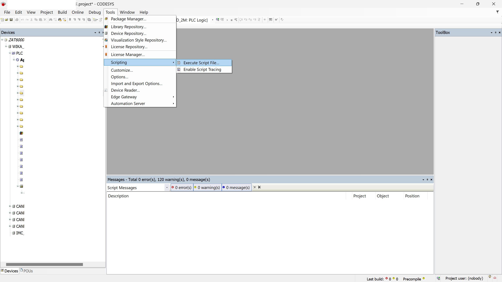
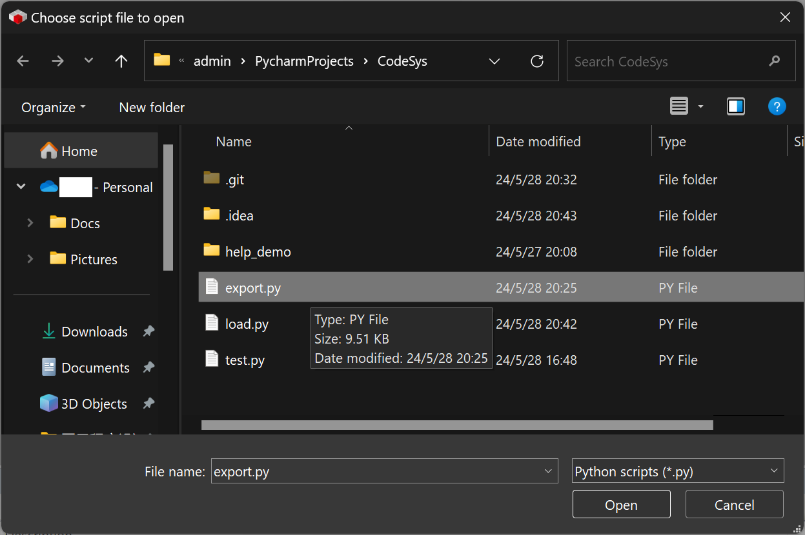
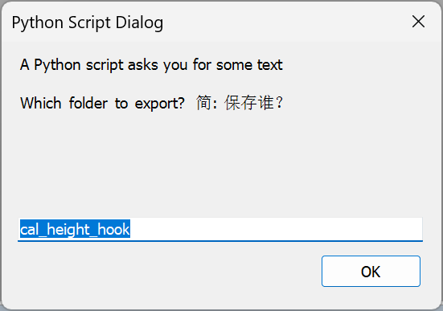
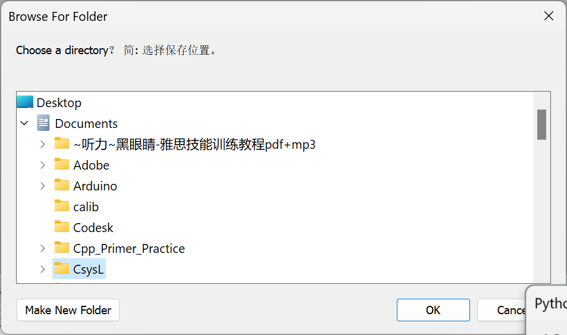
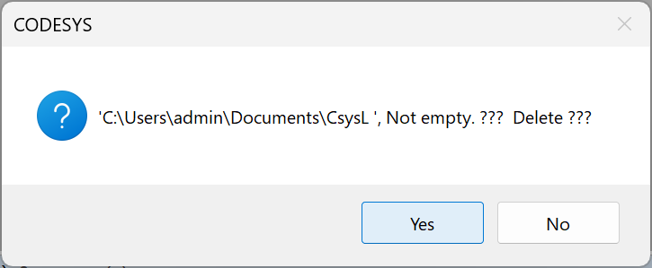
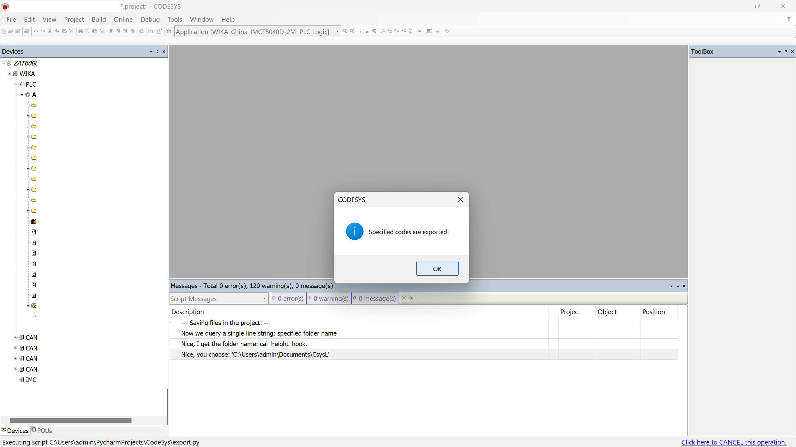
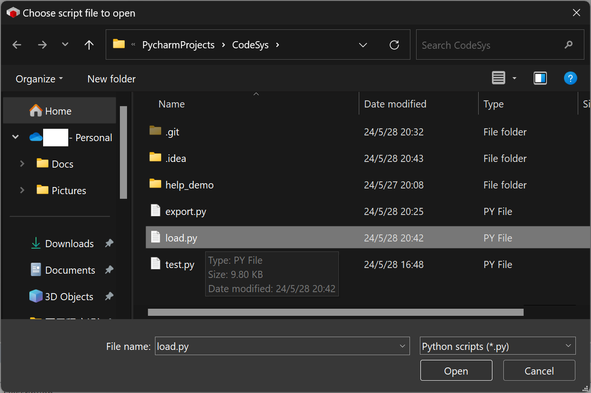
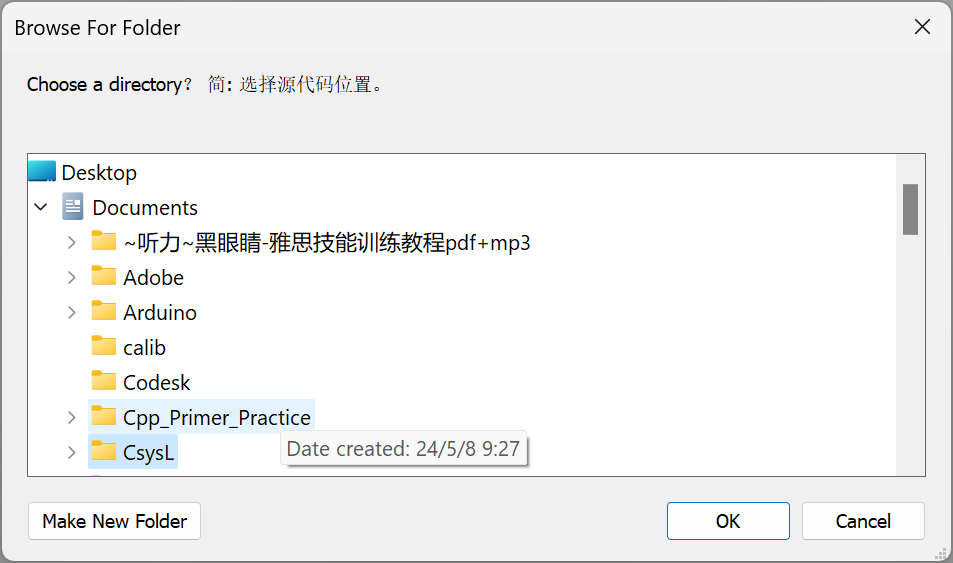
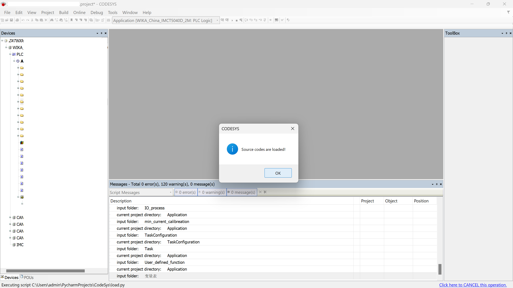

# CodeSys

## 使用方法:

若想在**工具栏使用图标运行**
脚本，请参考 [executing_scripts_toolbar](https://content.helpme-codesys.com/en/CODESYS%20Scripting/_cds_executing_scripts_toolbar.html)
和利用相关文件 [`Script Commands`](advanced/Script%20Commands)。

在 CodeSys 软件内执行脚本。

1. 菜单执行
   

`export.py`:

1. 选择脚本
   
2. 选择要导出的代码（目录），留空为整个目录
   
3. 选择文件夹（导出到）
   
4. 文件夹非空提示，是否删除其中的文件
   
5. 结果信息
   

`load.py`:

1. 选择脚本
   
2. 选择文件夹（从导入）
   
3. 结果信息
   

## 脚本说明:

`export.py`:

- [x] 将 Codesys 内的 ST 语言的文本代码 和 Global_var, Textlist 和 Task_Configuration, library 备份到 Save_Folder 文件夹。
- [x] 将指定的文件夹内的 文本代码 备份到 Save_Folder 文件夹，不指定则为工况全部的文本代码。
- [x] 若导出某个文件夹，则包括其子文件夹。
- [x] 若 Save_Folder 文件夹 非空，则提示要删除其中文件，但不包括 `.git` 与 `.svn` 文件。
- [ ] 如果文件夹内存在 .git 文件,则将文件夹更新到 HEAD 。

`load.py`:

- [x] 将上述文件夹内文本代码的导入到当前工程。
- [ ] 设备文件夹/文件导入。
- [x] 支持 `pou` 增加的 `Method`支持 `Action` 。
- [ ] 支持 `pou` 的 `Property` ，支持 `Property Method`。

[`advanced/Burn&Login.py`](advanced/Burn&Login.py):

- [x] 一键化编译、另存为、烧录（登录）、开始 `Run` （<kbd>F5</kbd>）。
- [x] 使用该脚本时：先编译当前程序，若有错误直接退出脚本，后续不再执行。
- [x] 使用该脚本时：当前程序版本信息中的主版本不变、次版本不变、生成号加 `1` 、修订号不变；同时添加作者信息。
- [x] 使用该脚本时：当前程序另存为 `Burned-on-"%Y%m%d-%H%M%S".project` ，删除程序密码；若当前程序已经是
  `Burned-on-"%Y%m%d-%H%M%S".project` ，则不操作另存为，仅修改版本信息。
- [x] 使用该脚本后：`Burned-on-"%Y%m%d-%H%M%S".project` 为只读，因为其 `released` 被设置为 `True`
  。（因为文件的只读属性在云同步时会丢失，所以通过设置 `released` 保持该文件只读，且可云同步）。
- [x] 使用该脚本后：`Burned-on-"%Y%m%d-%H%M%S".project` 的 `Description` 设置为
  `Only for recording diff between all versions`。
- [x] 使用该脚本后：对 `Burned-on-"%Y%m%d-%H%M%S".project` 自动执行烧录，烧录后自动开始 `Run` ，即按下 <kbd>F5</kbd>。

[`Assistive Intelligence/assist_en.ahk`](Assistive%20Intelligence/assist_en.ahk):

- [x] Require: `Codesys` 设置语言为 `English` ， 依赖软件 [AutoHotkey v2.0](https://www.autohotkey.com/)。
- [x] 另开文件，适配中文窗口 [`Assistive Intelligence/assist_chs.ahk`](Assistive%20Intelligence/assist_chs.ahk):
- [x] 根据现有规则，自动输入密码，但不点击确认。
- [x] 打开 project 后，自动关闭 `Environment` 界面。
- [x] 绑定热键，在 Codesys 中按下 <kbd>=</kbd> 键，输入 <kbd>:=</kbd> 。
- [x] 绑定热键，在 Codesys 中按下 <kbd>Alt</kbd> + <kbd>=</kbd> 键，输入 <kbd>=</kbd> 。
- [x] 绑定热键，在 Codesys 中按下 <kbd>PgDn</kbd> 开启碎片化修改提示（已开启则提示下一步），需要事先自己将差异模板化、步骤化。
- [x] 绑定热键，在 Codesys 中按下 <kbd>PgUp</kbd> 提示碎片化修改上一步。
- [x] 绑定热键，在 Codesys 中按下 <kbd>Pause</kbd> 临时关闭碎片化修改提示。
- [x] 绑定热键，在 Codesys 中连按两下 <kbd>Pause</kbd> 重置提示，从第一步开始。
- [x] 绑定热键，在 Codesys 中按下 <kbd>`</kbd> 若某一个步有细节步骤，则将细节步骤的关键词送至 <kbd>Ctrl</kbd> + <kbd>
  F</kbd>，自动点击搜索下一个，若没找到则自动关闭弹窗，若找到将返回界面光标处。
- [x] 绑定热键，在 Codesys 中按下 <kbd>`</kbd> 若某一个步有多个细节步骤，每次按下则将下一个关键词送至 <kbd>
  Ctrl</kbd> + <kbd>F</kbd>，到最后一个细节步骤时再次按下则循环至第一个关键词。

[`advanced/module_detection.py`](advanced/module_detection.py):

- [x] 模块检测，依赖文件夹名或文件内的关键词。支持 `Codesys` 中给出结果。
- [x] 使用 [`module_detect.ps1`](advanced/module_detect.ps1) ，在终端内批量检测并输出结果至 `csv` 。

[`advanced/extract_archive.py`](advanced/extract_archive.py):

- [x] 批量将存档文件解压到指定文件夹。
- [x] 不支持 Codesys 中运行。
- [x] 依赖于 [`extract_archive.ps1`](advanced/extract_archive.ps1) 批量运行。

[`advanced/overwrite.py`](advanced/overwrite.py):

- [x] 文件重写，依赖文件夹名或文件内的关键词，同名文件只处理第一个。支持 `Codesys` 中给出结果。
- [x] 弹窗询问若有同名文件（界面执行时），终端仍然默认只有一个且选第一个。
- [x] 使用 [`overwrite.ps1`](advanced/overwrite.ps1) ，在终端内批量写入所有子目录工程的同一个文件并输出结果至 `csv` 。

云同步：
- `push`: `rsync -avc --exclude='.*' --exclude='__pycache__/' --exclude='venv/' ./ ~/OneDrive/13ANH/PycharmProjects/CodeSys`
- `pull`: `rsync -avc --exclude='.*' --exclude='__pycache__/' --exclude='venv/' ~/OneDrive/13ANH/PycharmProjects/CodeSys ./`
## 问题:

- 除ST语言的文本外,其他如: Visu,imagePool, VisuConfiguration, Project Settings, Project Infomation 没有导出.
- GlobalTextList 会丢失 ID Column 的数据.

## 致谢:

- [`CODESYS Online Help`](https://help.codesys.com/webapp/System;product=ScriptEngine)
- [`18thCentury/CodeSys`](https://github.com/18thCentury/CodeSys)